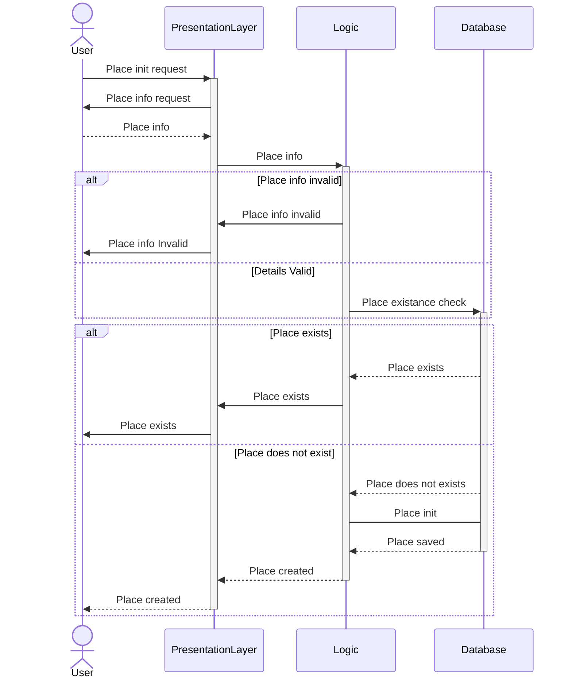

```mermaid
sequenceDiagram
actor User
participant PresentationLayer 
participant Logic
participant Database

User->>+PresentationLayer: Place init request
PresentationLayer->>User: Place info request
User-->>PresentationLayer: Place info
PresentationLayer->>+Logic: Place info
alt Place info invalid
    Logic->>PresentationLayer: Place info invalid
    PresentationLayer->>User: Place info Invalid
else Details Valid
    Logic->>+Database: Place existance check
end
alt Place exists
    Database-->>Logic: Place exists
    Logic->>PresentationLayer: Place exists
    PresentationLayer->>User: Place exists
else Place does not exist
    Database-->>Logic: Place does not exists
    Logic->Database: Place init
    Database-->>-Logic: Place saved
    Logic-->>-PresentationLayer: Place created
    PresentationLayer-->>-User: Place created
end
```
