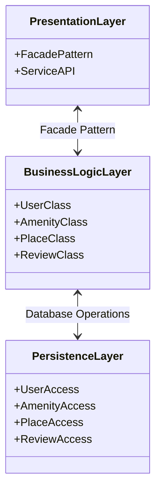

# HBnB Evolution - Technical Documentation

## Task 0 - High-Level Package Diagram

## Layer Descriptions

### Presentation Layer -- BRENDAN --
A simplified GUI designed for user simplified user interaction. This layer will handle user interface, input and communication with the backend services. This layer should display public and relevant data to users, handle page navigation and UI interactions. The presentation layer should include login forms, listings, review submission forms, and filtering interfaces.

### Business Logic Layer -- SEABASS --
quick basic description goes here

### Persistence Layer -- LUCAS --
The Persistence Layer is the part of the application that saves and loads data from the database.In this proyect, it handles storing, updating, deleting, and retrieving information about User, Place, Review, and Amenities.This layer keeps the database logic separate from the rest of the application.

### Facade Pattern
The Facade Pattern is a manager acting as the gatekeeper between the user interface and a complex subsystem which contains lots of moving parts. Imagine a hotel front desk in the real world, where a client presents in an attempt to book a room. The manager at the front desk simplifies the process by understanding the hotel's processes but presenting the information to the client in a way that they understand and does not contain unnecessary additional information. In HBnB, the Facade Pattern sits within the Presentation Layer and acts as the sole communication point between the Presentation Layer and the Business Logic Layer.
