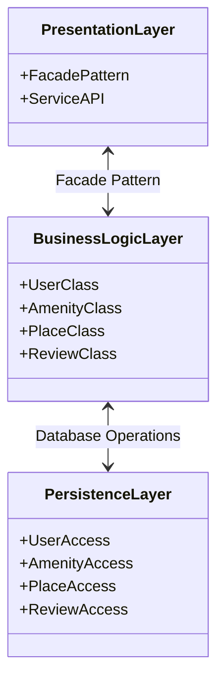

# HBnB Evolution - Technical Documentation

## Task 0 - High-Level Package Diagram

## Layer Descriptions

### Presentation Layer -- BRENDAN --

### Business Logic Layer -- SEABASS --

### Persistence Layer -- LUCAS --

### Facade Pattern
The Facade Pattern is a manager acting as the gatekeeper between the user interface and a complex subsystem which contains lots of moving parts. Imagine a hotel front desk in the real world, where a client presents in an attempt to book a room. The manager at the front desk simplifies the process by understanding the hotel's processes but presenting the information to you in a way that you understand and does not contain unnecessary additional information. In HBnB, the Facade Pattern sits within the Presentation Layer and acts as the sole communication point between the Presentation Layer and the Business Logic Layer.