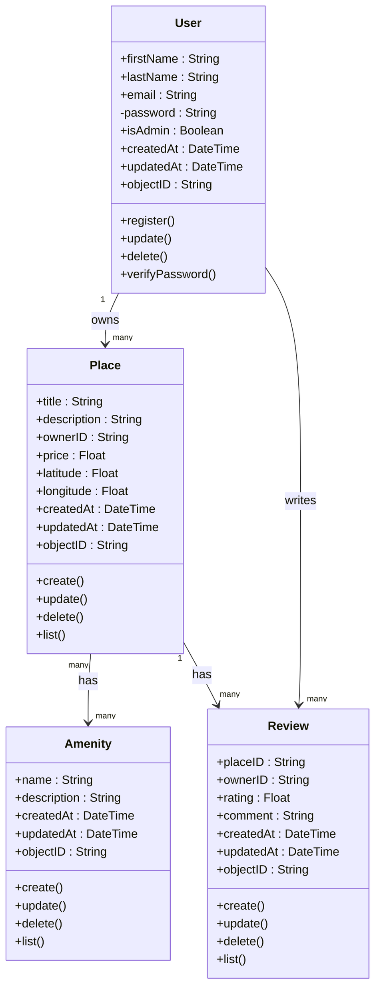

# HBnB proyect - Technical Documentation

## Task 1 - Detailed Class Diagram for Business Logic Layer

```mermaid
classDiagram
direction TB
    class User {
	    +firstName : String
	    +lastName : String
	    +email : String
	    -password : String
	    +isAdmin : Boolean
	    +createdAt : DateTime
	    +updatedAt : DateTime
	    +objectID : String
		+register()
	    +update()
	    +delete()
	    +verifyPassword()
    }

    class Place {
	    +title : String
	    +description : String
		+ownerID : String
	    +price : Float
	    +latitude : Float
	    +longitude : Float
	    +createdAt : DateTime
	    +updatedAt : DateTime
	    +objectID : String
	    +create()
	    +update()
	    +delete()
	    +list()
    }

    class Amenity {
    	  	+name : String
		+description : String
		+createdAt : DateTime
		+updatedAt : DateTime
		+objectID : String
		+create()
		+update()
		+delete()
		+list()
	}

	class Review{
		+placeID : String
		+ownerID : String
		+rating : Float
		+comment : String
		+createdAt : DateTime
		+updatedAt : DateTime
		+objectID : String
		+create()
		+update()
		+delete()
		+list()
	}


    User "1" --> "many" Place : owns
    User "1" --> "many" Review : writes
    Place "many" --> "many" Amenity : has
    Place "1" --> "many" Review : has

```