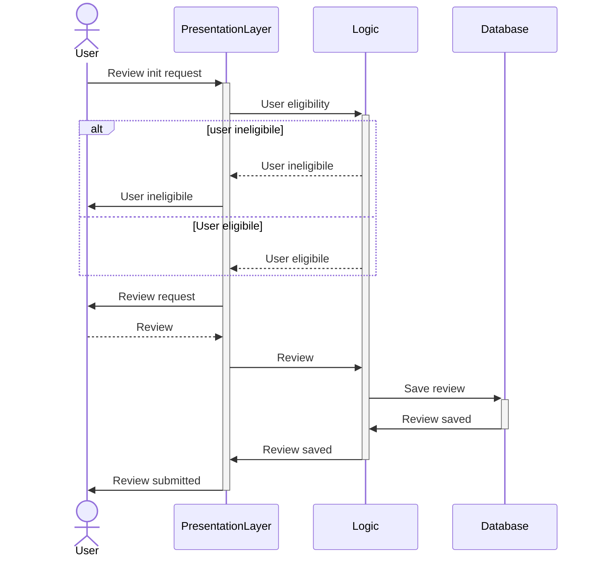

```mermaid
sequenceDiagram
actor User
participant PresentationLayer 
participant Logic
participant Database

User->>+PresentationLayer: Review init request
PresentationLayer->>+Logic: User eligibility
alt user ineligibile
    Logic-->>PresentationLayer: User ineligibile
    PresentationLayer->>User: User ineligibile
else User eligibile
    Logic-->>PresentationLayer: User eligibile
end
PresentationLayer->>User: Review request
User-->>PresentationLayer: Review
PresentationLayer->>Logic: Review
Logic->>+Database: Save review
Database->>-Logic: Review saved
Logic->>-PresentationLayer: Review saved
PresentationLayer->>-User: Review submitted
```
