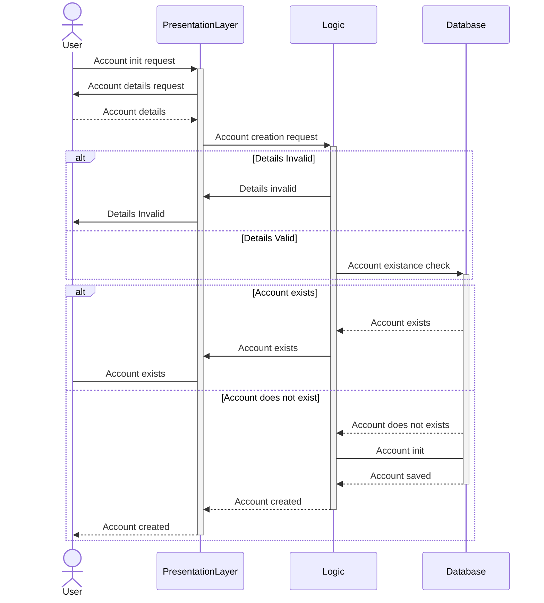

```mermaid
sequenceDiagram
actor User
participant PresentationLayer 
participant Logic
participant Database

User->>+PresentationLayer: Account init request
PresentationLayer->>User: Account details request
User-->>PresentationLayer: Account details
PresentationLayer->>+Logic: Account creation request
alt Details Invalid
    Logic->>PresentationLayer: Details invalid
    PresentationLayer->>User: Details Invalid
else Details Valid
    Logic->>+Database: Account existance check
end
alt Account exists
    Database-->>Logic: Account exists
    Logic->>PresentationLayer: Account exists
    PresentationLayer->User: Account exists
else Account does not exist
    Database-->>Logic: Account does not exists
    Logic->Database: Account init
    Database-->>-Logic: Account saved
    Logic-->>-PresentationLayer: Account created
    PresentationLayer-->>-User: Account created
end
```
